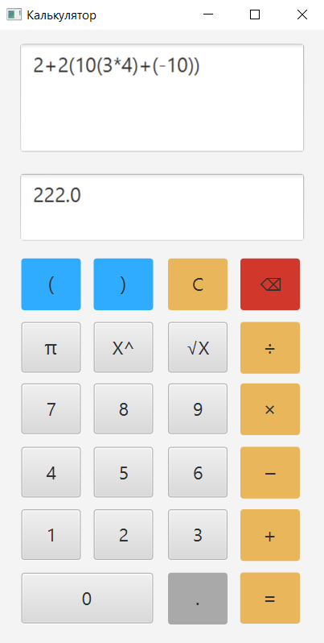
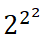

2+2(10(3*4)+(-10)) 

  <h1>Правила вводу даних</h1> 
<ul>
    <li>Відємні числа записи: 2+-2 і 2+(-2)  рівнозначні</li>
    <li>Спепінь 2^2^2 не рівна  потрібно 2^(2^2).</li>
    <li>Корінь реалізований через степінь числа <1. квадратний корінь це 1/2...</li>
    <li>ділення можна використовувати як '/' так і '÷' різниці намає.</li>
    <li>Також і множеня '×' і '*' різниці.</li>
    <li>Число пі 'π' це єдиний спосіб введення.</li>
    <li>Дробові числа вводяться тільки через '.'.</li>
    <li>введеня буков і не задіяних символів повінсть ігнорується Лексером і неяк не вплине на результат. "2[число] *  π[пі] = ?" буде дорівнювать 6.28318530718 </li>
    <li>дужки повінні бути вікриті і обов'язково закриті в іншому випадку буде виключення.</li>
</ul>
